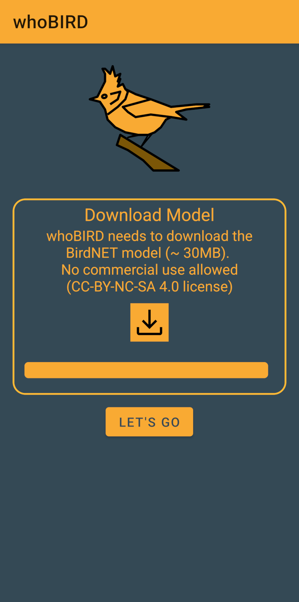
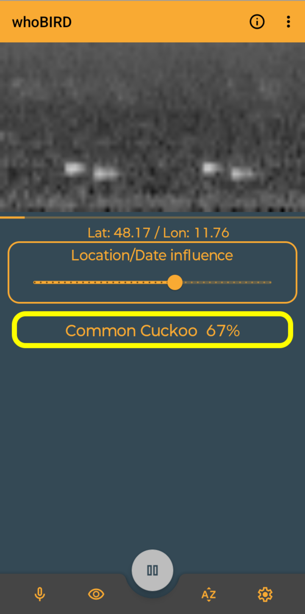
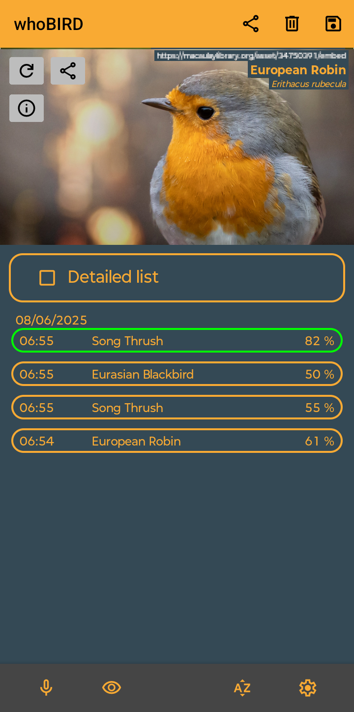

Enjoying this app? Help us grow by sharing #whobird with your friends and followers on Instagram! Together, let's build a vibrant community!

<pre>Send a coffee to 
woheller69@t-online.de 
</pre>

# whoBIRD

  

Introducing whoBIRD, the ultimate birding companion that can recognize birds by their sounds, anywhere in the world!
Powered by the cutting-edge BirdNET project, whoBIRD boasts an extensive database of over 6,000 bird species worldwide.
Using advanced machine learning algorithms, the app can accurately identify birds based on their unique vocalizations.

What's more, whoBIRD performs its magic entirely on your device, without requiring an internet connection.
This means you can use it anytime, anywhere – whether you're deep in the forest or at the edge of a remote lake.

# License
This work is licensed under GPLv3

- This app is built on the [BirdNET framework](https://github.com/kahst/BirdNET-Lite) by [**@kahst**](https://github.com/kahst), published under CC BY NC SA 4.0 license
- At first start it downloads the BirdNet TFLite library from [whoBird-TFlite](https://github.com/woheller69/whoBIRD-TFlite), which is published under CC BY NC SA 4.0 license
- Label files from BirdNET are used under GPL 3.0 with [permission from the author](https://github.com/woheller69/whoBIRD/issues/1)
- It uses code from [Tensorflow](https://www.tensorflow.org/lite/examples) examples, published under [Apache 2.0 license](https://www.apache.org/licenses/LICENSE-2.0.html)

# OTHER APPS

| **RadarWeather** | **Gas Prices** | **Smart Eggtimer** |
|:---:|:---:|:--:|
| |  |  |
| **Bubble** | **hEARtest** | **GPS Cockpit** |
|  |  |  |
| **Audio Analyzer** | **LavSeeker** | **TimeLapseCam** |
|  | |  |
| **Arity** | **omWeather** | **solXpect** |
|  |  |  |
| **gptAssist** | **dumpSeeker** | **huggingAssist** |
|  |  |  |
| **FREE Browser** | **whoBIRD**| |
|  |  | |

